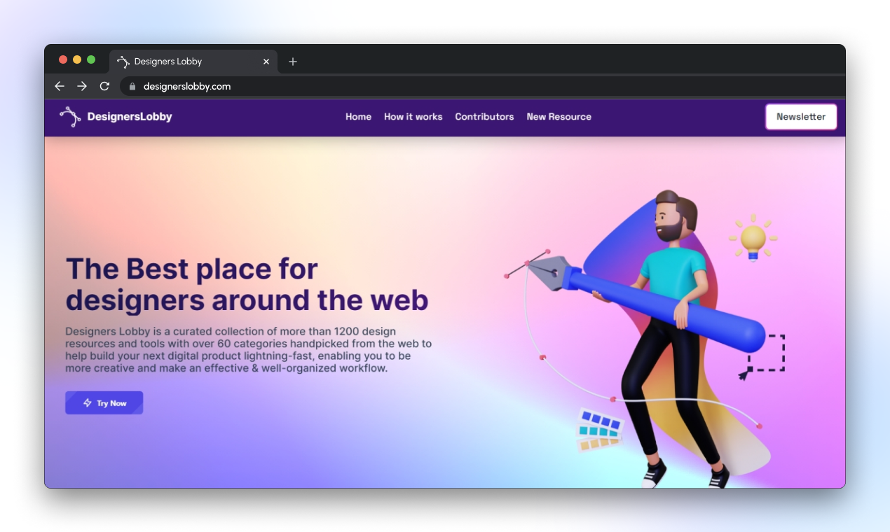
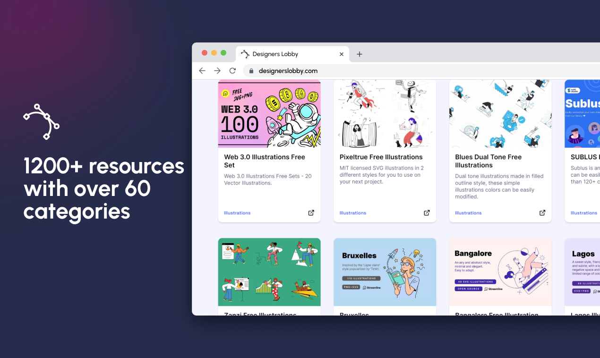

<p align="center">
<a href="https://www.designerslobby.com/">

</a>
</p>

<p align="center">
<a href="https://www.designerslobby.com">

</a>
</p>

<h3 align="center">All your Design Resources & Tools in one place</h3>

<p align="center">
<a href="">

</a>
<a href="">

</a>
<a href="">

</a>
<a href="">

</a>
<a href="">

</a>
<a href="https://twitter.com/intent/tweet?text=Checkout%20desigerslobby.com%20by%20@thenitinsingh7%0A%0AWorld's%20biggest%20collection%20of%20Best%20design%20resources%20and%20tools%20all%20in%20one%20place,%20with%20amazing%20features.%20This%20is%20something%20you%20don't%20want%20to%20miss!">

</a>
</p>

### Introducing Designers Lobby

Designers Lobby is a curated collection of more than 1200 design resources and tools with over 60 categories handpicked from the web to help build your next digital product lightning-fast, enabling you to be more creative and make an effective & well-organized workflow.

[Read Blog]()

## Demo

<a href="https://www.designerslobby.com/">

</a>

<a href="https://www.designerslobby.com/">

</a>

<a href="https://www.designerslobby.com/">

</a>

Try the App: [Designers Lobby](https://www.designerslobby.com/)

### Features

Designers Lobby is super huge with more than 1200 resources and tools over 60 categories, Some of the best features of the app.

- 😍 **1200+ Resources**
- 🥳 **60 Categories**
- 📁 **Filter by Category**
- 🔍 **Filter by Search**
- 👨 **Contributors Page**
- 📧 **Newsletter feature**
- 🌙 **Dark mode**
- 📱 **Fully Responsive**
- ➕ **Add a new resource**
- 📈 **Trending Resources**
- 🎨 **Clean User Interface**
- 🤼 **Built for Everyone**

## Installation Steps

1. Clone the repository

```bash
git clone
```

2. Changed the working directory

```bash
cd designerslobby
```

3. Install dependencies

```bash
npm install
```

4. Create `.env` file in root and add your variables

```bash

```

5. Run the app

```bash
npm start
```

## Built with

- [React JS](https://reactjs.org/)
- [Tailwind CSS](https://tailwindcss.com/): For complete styling
- [Material UI](http://material-ui.com/): For Components
- [react-icons](https://react-icons.github.io/react-icons/): for icons
- [react-hot-toast](https://react-hot-toast.com/): for toasts
- [AOS](https://michalsnik.github.io/aos/): for scroll animations
- [Animate.css](https://animate.style/): for smooth animations
- [Node JS]():
- [Mongo DB]():
- [Express JS]():
- [Vercel](http://vercel.com/):
- [Netlify](https://www.netlify.com/):for Hosting

## License

This project is licenced under the MIT License - see the [`LICENSE`](LICENSE) file for details.

## 👫 Thanks to the all Resource Contributors

A big thanks to all the contributors who helped Designers Lobby and the Design community grow! Thank you! We thank all of them wholeheartedly.

keep rocking 🍺

Check them on [designerslobby.com/contributors](https://www.designerslobby.com/contributors)

## 🙏 Support

Don't forget to leave a star ⭐
